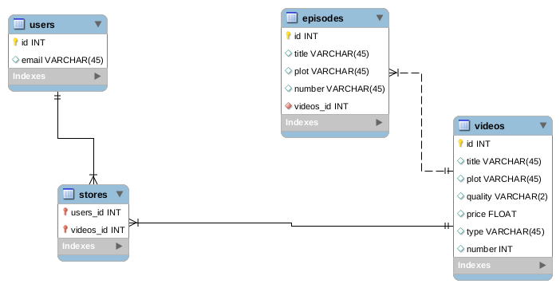

# Tv-web
back-end in Ruby on Rails for tv-web.
#DB Model

#For test
- clone the repo.
- run bunlde 
- run rails db:create
- run rails db:migrate
- run rails s
#Routes
- users crud
- videos crud
- episodes crud
- movies
- seasons
- purchase 
- stores